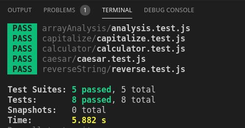

# JS Unit Tests

> This project was created to test several different functions using TDD with Jest.

# Screenshot

## Built With

- JavaScript
- NPM
- Jest

## Usage
- Clone the repo and move into the project directory
- Run "npm install"
- Run "npm run test"

## Authors

👤 **Sebastian Gil Rodriguez**

- Github: [@sebGilR](https://github.com/sebGilR)
- Twitter: [@sebGilR](https://twitter.com/sebGilR)
- Linkedin: [sebastiangilrodriguez](https://www.linkedin.com/in/sebastiangilrodriguez)

👤 **Dannison Arias**

- Github: [@dannisonarias](https://github.com/dannisonarias)
- Twitter: [@AriasDannison](https://twitter.com/AriasDannison)
- Linkedin: [dannisonarias](https://www.linkedin.com/in/dannisonarias/)

## 🤝 Contributing

Contributions, issues and feature requests are welcome!

Feel free to check the [issues page](issues/).

## Show your support

Give a ⭐️ if you like this project!
